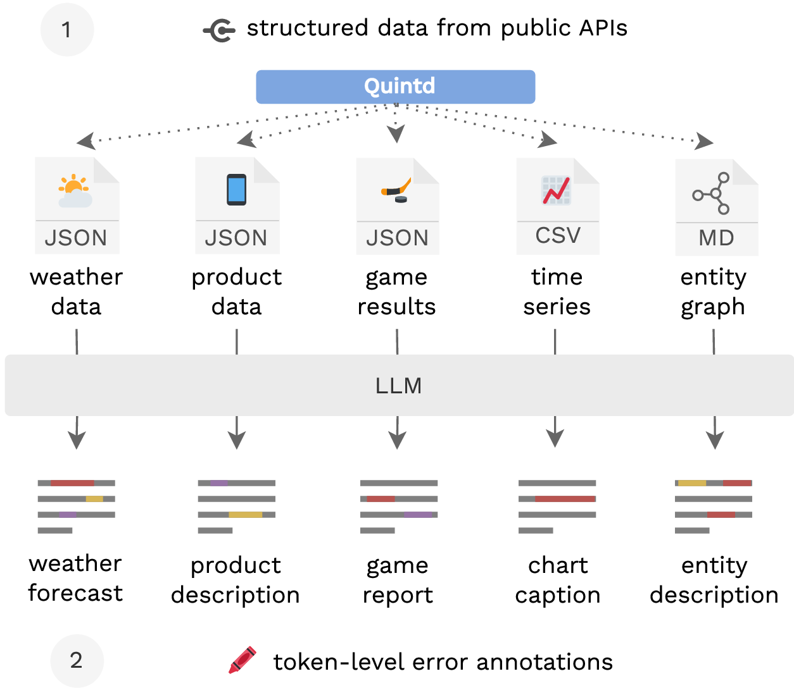
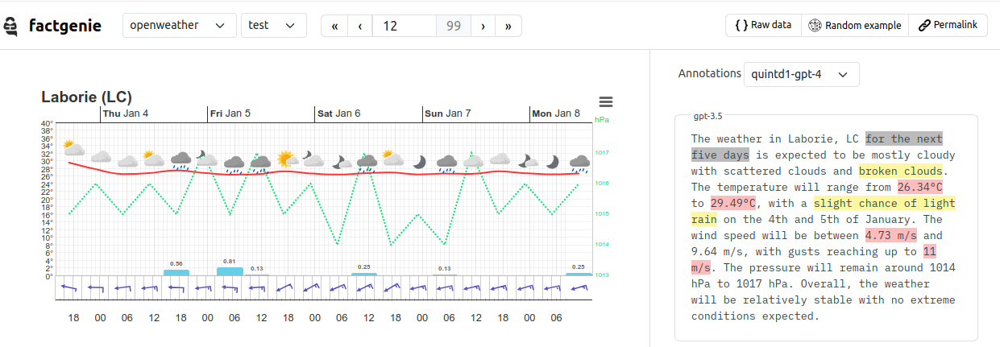

# ⚄ quintd
Data-to-text generation with LLMs using ad-hoc datasets.

Project website: https://d2t-llm.github.io

## Datasets

Quintd is a tool for downloading structured data from five data-to-text generation tasks. Each task uses data from a distinct domain:

| Domain        | Task          | Task Description                                        | Source                                       | Format   |
| ------------- | ------------- | ------------------------------------------------------- | -------------------------------------------- | -------- |
| 🌦️ Weather     | `openweather` | Generating a weather forecast from weather data.        | [OpenWeather](https://openweathermap.org)    | JSON     |
| 📱 Technology  | `gsmarena`    | Describing a product based on its attributes.           | [GSMArena](https://www.gsmarena.com)         | JSON     |
| 🏒 Sport       | `ice_hockey`  | Describing an outcome of an ice-hockey game.            | [RapidAPI](https://rapidapi.com)             | JSON     |
| 📈 Health      | `owid`        | Generating a caption for a time series.                 | [OurWorldInData](https://ourworldindata.org) | CSV      |
| 🌐 World facts | `wikidata`    | Describing entities and relations in a knowledge graph. | [Wikidata](https://wikidata.org)             | Markdown |

We use the data to evaluate semantic accuracy of data-to-text generation outputs. 

As the data comes *without reference outputs*, the evaluation is done using referenceless metrics (checking whether the outputs are grounded in the input data).

## Preliminaries
The code is tested with Python 3.10. Make sure to install the required packages first:
```bash
pip install -r requirements.txt
```

## Project Overview
The code enables to replicate the experiments described in [our paper](https://arxiv.org/abs/2401.10186):
> Zdeněk Kasner & Ondřej Dušek: Beyond Traditional Benchmarks:
Analyzing Behaviors of Open LLMs on Data-to-Text Generation. In: Proceedings of the 62th Annual Meeting of the Association for Computational Linguistics (ACL 2024).

. The experiments consist of three stages:

- **Collecting structured data** using Quintd.
- **Generating data-based reports** using LLMs.
- **Annotating outputs** using LLMs and human annotators.



## Collecting structured data

Quintd is a tool for downloading "ad hoc" test sets. The goal is to have evaluation data not included in the training data of the LLMs.

There are two ways that Quintd achieves that:
- downloading up-to-date data (for the weather forecasts, partially also for products and game results),
- selecting different examples based on the random seed.

The recommended approach is to **download a fresh test set for each set of experiments**.

### How-to
Here is how to generate a new dataset with Quintd:
```bash
python data/generate_dataset.py -d [DOMAIN] -n [EXAMPLES] -r [SEED] -o [OUT_DIR]
```

A basic setting which will generate a small dataset (10 examples per domain) with the random seed 7331:
```
NUM_EXAMPLES=10
SEED=7331

python data/generate_dataset.py -n $NUM_EXAMPLES -r $SEED
```

In our experiments, we generated one such dataset which we dubbed Quintd-1.
The dataset is available in [data/quintd-1/data](data/quintd-1/data).

The following code will try to replicate the data collection for Quintd-1 (up to some differences in API responses):
```
python data/generate_dataset.py --replicate
```

## Generating data-based reports
Data-to-text generation requires having access to a LLM through an API. The code we provide here is tested with:
- [text-generation-webui](https://github.com/oobabooga/text-generation-webui) (commit [d01c68f](https://github.com/oobabooga/text-generation-webui/commit/d01c68f2a3084b35b0faca799814feb4a92b2287)) - used for open LLMs.
- [OpenAI API](https://platform.openai.com/docs/overview) (as of 13/07/2024) - used for GPT-3.5.

It should be fairly easy to connect the code with any other OpenAI-like API.

### How-to
Here is how to generate outputs for a particular domain, model, and setup:
```bash
python model/generate.py -d [DOMAIN] -s [SETUP] -m [MODEL] -p [DATASET_PATH] -a [API_URL]
```

Example:
```bash
export TG_WEBUI_API_URL="http://tdll-8gpu1.ufal.hide.ms.mff.cuni.cz:5000"
python model/generate.py -d ice_hockey -s direct -m zephyr -p data/quintd-1 -a $TG_WEBUI_API_URL 
```
You can also run the experiments with a single command:
```bash
python run_experiments.py
```

See the config file [model/setups/direct.yaml](model/setups/direct.yaml) for the model prompt and other hyperparameters.

The generated outputs for Quintd-1 are available in [data/quintd-1/outputs](data/quintd-1/outputs).

## Annotating outputs

We published our framework for annotating errors in LLM outputs as a standalone project 🎉 

 👉️ **[factgenie](https://github.com/kasnerz/factgenie)** 👈️

We highly recommended your to use factgenie for your own experiments instead of the code in this repository.



### How to
Here is how to replicate the LLM annotation process (without factgenie, using only the code in the repository).

For generating outputs for a particular domain, model, and setup:
```bash
python evaluation/evaluate.py -d [DOMAIN] -s [SETUP] -m [MODEL] -p [DATASET_PATH]
```
Example:
```bash
python evaluation/evaluate.py -d ice_hockey -s direct -m zephyr -p data/quintd-1
```
You can also run the evaluation with a single command:
```bash
python run_gpt4_eval.py
```
The error annotations for Quintd-1 are available in [data/quintd-1/annotations](data/quintd-1/annotations).

Note that error annotation using GPT-4 requires access to the [OpenAI API](https://platform.openai.com/docs/api-reference).

## Code structure overview

- [data](data/) - **Quintd** data collection framework.
    - [generate_dataset.py](data/generate_dataset.py) - A script for generating a new dataset & replicating the collection of Quintd-1.
- [data/quintd-1](data/quintd-1) - Resources for the **Quintd-1** dataset.
    - [annotations](data/quintd-1/annotation) - Error annotations (GPT-4 / human).
    - [data](data/quintd-1/data) - Data inputs.
    - [outputs](data/quintd-1/outputs) - Generated model outputs.
- [run_experiments.py](run_experiments.py) - A wrapper code for running **text generation**.
- [run_gpt4_eval.py](run_experiments.py) - A wrapper code for running **GPT-4 evaluation**.


## How to cite us
*Note: If this page is not updated by the time that ACL 2024 proceedings are published, please use the BibTeX from ACL Anthology instead.*
```
@inproceedings{kasnerReferenceBasedMetricsAnalyzing2024,
  title     = {Beyond {{Traditional Benchmarks}}: {{Analyzing Behaviors}} of {{Open LLMs}} on {{Data-to-Text Generation}}},
  author    = {Kasner, Zden{\v e}k and Du{\v s}ek, Ond{\v r}ej},
  booktitle = {Proceedings of the 62nd Annual Meeting of the Association for Computational Linguistics (Volume 1: Long Papers)},
  year      = {2024},
  note      = {To appear},
  url       = {http://arxiv.org/abs/2401.10186}
}        
```
